## 第一件事就做下面的事：

# [点击此处文字即可加入QQ群~~](https://qun.qq.com/universal-share/share?ac=1&authKey=ZNzJ3VtK2ccdPBV42XFL9rIe4wCXRDREp6z%2BHk2eZsJ4WPKBuDyc6bFXO1eNsdqI&busi_data=eyJncm91cENvZGUiOiIxMDEyMDYyNDQwIiwidG9rZW4iOiJTUzBadXBoRklDZnEvSGE3SHAyRkU1L2FycGVKdExpZkFiRVdLVmc4YkVaeEhycDhabkNLQStwSkFDZlJ0SG9kIiwidWluIjoiMjE5MjI5MjM5MiJ9&data=QqnggGwoT22EUgoccf632Z6wlMgzxyQKSGlQq34_vlwBTI6U6913XJZoFih2_qn00sPXj1oFRMspSnoOujMRyitXqvBYS7F1d7KHI6fV9Bc&svctype=5&tempid=h5_group_info)

# [点击此处文字即可加入QQ群~~](https://qun.qq.com/universal-share/share?ac=1&authKey=ZNzJ3VtK2ccdPBV42XFL9rIe4wCXRDREp6z%2BHk2eZsJ4WPKBuDyc6bFXO1eNsdqI&busi_data=eyJncm91cENvZGUiOiIxMDEyMDYyNDQwIiwidG9rZW4iOiJTUzBadXBoRklDZnEvSGE3SHAyRkU1L2FycGVKdExpZkFiRVdLVmc4YkVaeEhycDhabkNLQStwSkFDZlJ0SG9kIiwidWluIjoiMjE5MjI5MjM5MiJ9&data=QqnggGwoT22EUgoccf632Z6wlMgzxyQKSGlQq34_vlwBTI6U6913XJZoFih2_qn00sPXj1oFRMspSnoOujMRyitXqvBYS7F1d7KHI6fV9Bc&svctype=5&tempid=h5_group_info)

# [点击此处文字即可加入QQ群~~](https://qun.qq.com/universal-share/share?ac=1&authKey=ZNzJ3VtK2ccdPBV42XFL9rIe4wCXRDREp6z%2BHk2eZsJ4WPKBuDyc6bFXO1eNsdqI&busi_data=eyJncm91cENvZGUiOiIxMDEyMDYyNDQwIiwidG9rZW4iOiJTUzBadXBoRklDZnEvSGE3SHAyRkU1L2FycGVKdExpZkFiRVdLVmc4YkVaeEhycDhabkNLQStwSkFDZlJ0SG9kIiwidWluIjoiMjE5MjI5MjM5MiJ9&data=QqnggGwoT22EUgoccf632Z6wlMgzxyQKSGlQq34_vlwBTI6U6913XJZoFih2_qn00sPXj1oFRMspSnoOujMRyitXqvBYS7F1d7KHI6fV9Bc&svctype=5&tempid=h5_group_info)

# [点击此处文字即可加入QQ群~~](https://qun.qq.com/universal-share/share?ac=1&authKey=ZNzJ3VtK2ccdPBV42XFL9rIe4wCXRDREp6z%2BHk2eZsJ4WPKBuDyc6bFXO1eNsdqI&busi_data=eyJncm91cENvZGUiOiIxMDEyMDYyNDQwIiwidG9rZW4iOiJTUzBadXBoRklDZnEvSGE3SHAyRkU1L2FycGVKdExpZkFiRVdLVmc4YkVaeEhycDhabkNLQStwSkFDZlJ0SG9kIiwidWluIjoiMjE5MjI5MjM5MiJ9&data=QqnggGwoT22EUgoccf632Z6wlMgzxyQKSGlQq34_vlwBTI6U6913XJZoFih2_qn00sPXj1oFRMspSnoOujMRyitXqvBYS7F1d7KHI6fV9Bc&svctype=5&tempid=h5_group_info)

---

## 自助购买卡网地址：
# [点击跳转发卡网](https://faka.lucklyee.xyz/)

---

## 软件下载地址
- [点击此处即可下载软件](https://lucklyee.lanzouv.com/b016kf8awj) 密码6666

## 使用指南、注意事项

1. **注意事项**

    - 禁止使用游戏加加 禁止使用游戏加加 禁止使用游戏加加⚠
    - 网吧用户注意: 不要使用副系统 不要使用副系统 不要使用副系统 ⚠
    - 不支持 AMD 系列 CPU 支持AMD显卡系列⚠
    - 必备： **开启电脑的VT-D 以及 VT-X VT虚拟化 游戏处于全屏 IZI 不支持 W11 24H2 其它系统版本全部支持 自备U盘 **

    > 在控制面板 关闭 Hyper-V
    - 关闭Hyper-V 教程:
    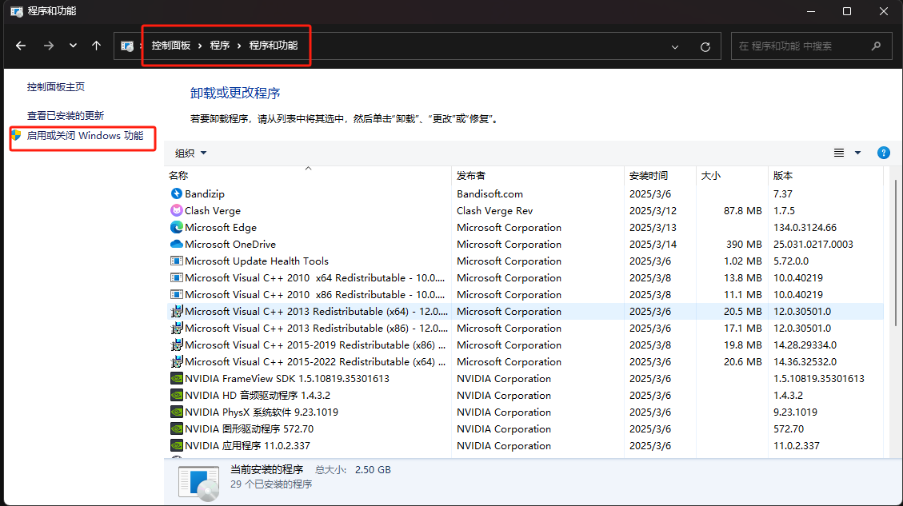
    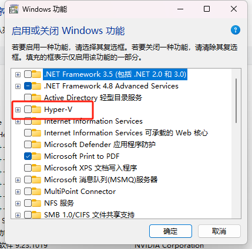

    - 关闭 重启电脑即可
    - 如果你不会开启 VT系列 请百度询问 例如 : 你的主板型号 + 如何开启VT虚拟化
    

2.  **首先获得 卡密 (请注意: 如果同一卡密多人解绑 直接 BAN)**

    - 获得卡密后 前往 [加载器(点击下载)](https://izicheats.net/client/client_download.php) 输入卡密即可下载
    - 下载后 会得到一个 压缩包 将 这个压缩包 放进 U盘
    - 随后在U盘中 右键 管理员方式 运行 软件
    - 按照提示 输入 卡密
    - 选择你要再注入的产品 (如果 注入 IZI电脑蓝屏 打开 此选项即可 )
    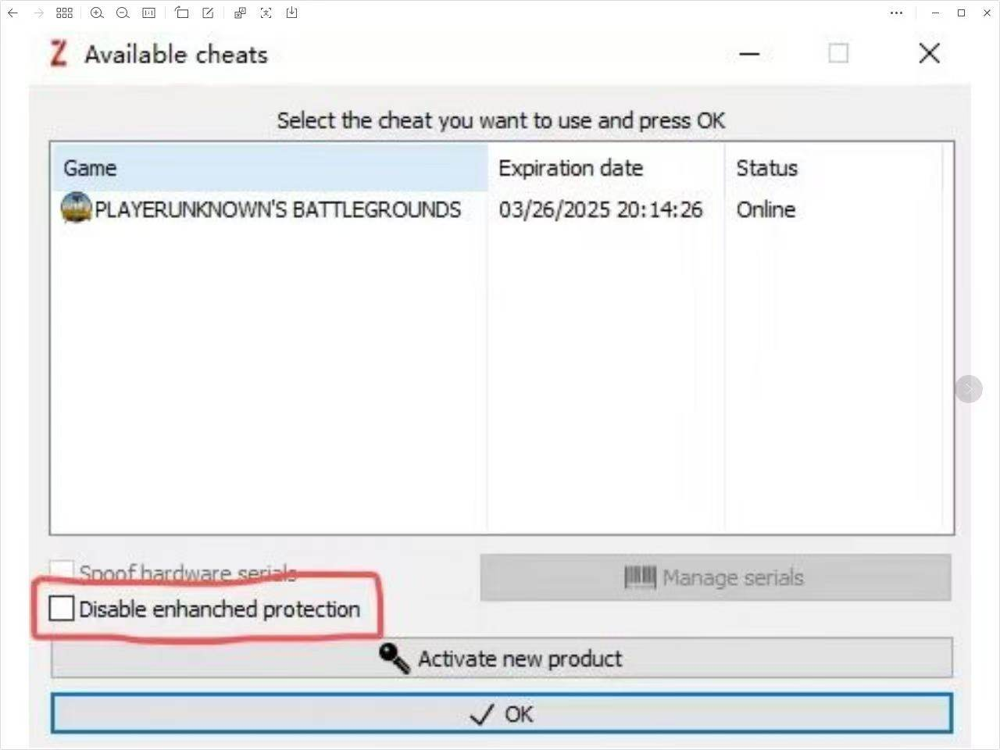

3. **注意事项FAQ:**

    - 在加载 驱动的时候 可能 你本来开启 VT系列了 但是还提示你 请开启 VT-D 以及 VT-X
    - 解决方案：先重启电脑 关闭VT系列 然后启动电脑 等待进入在桌面
    - 进入桌面后 在重启 开启 VT 系列 即可
    - 如果 你进游戏主界面 发现没菜单 也没任何报错 请切回在桌面 再切回游戏即可
    - 如果 你所有方法都尝试 发现还是提示 VT 未开启 请重装系统 管网系统下载

<!-- # IZI UEFI 部署教程
- 首先准备一个 I 盘右键格式化为 FAT32 注意：需要在 BIOS 中禁用安全启动！
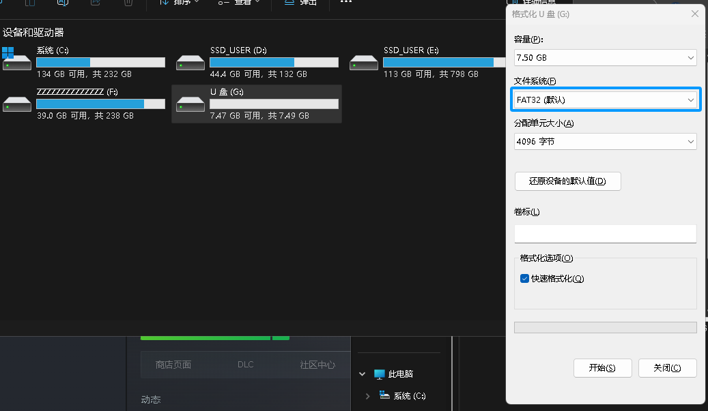
- 下载登录器 解压出来到 U 盘里面，如下图打勾 Use EFI module 随后点击 OK 注入
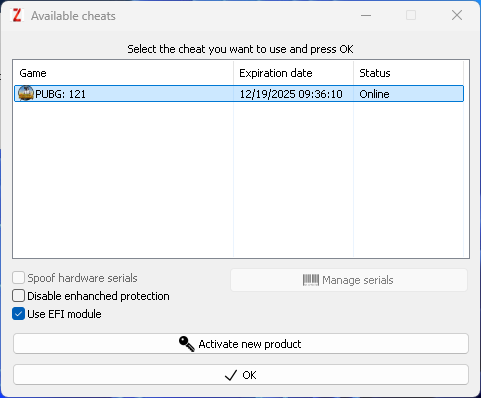
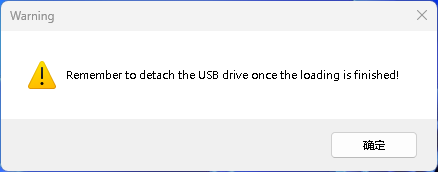
- 点击 Confirm
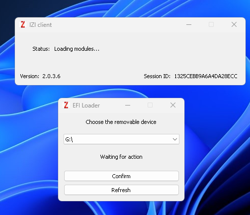
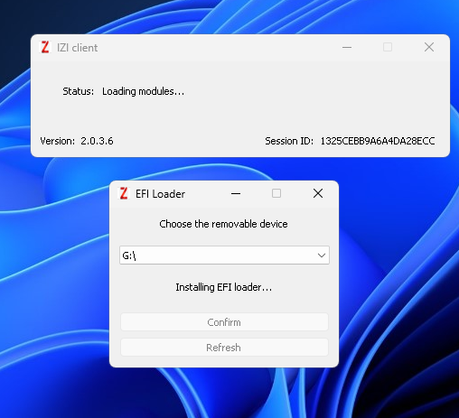
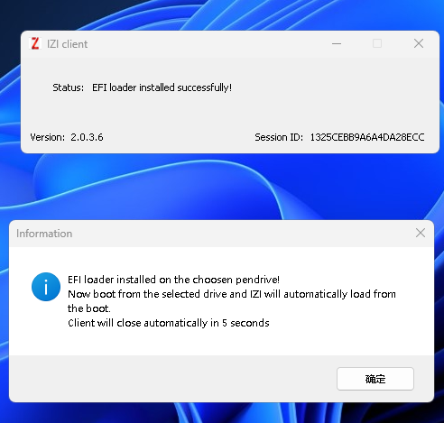
- 消失后重启电脑 （不要拔出 U 盘） 开机按 F12 选择 U 盘启动 如下图 UEFI:XXXXXXXXXX 就是 鼠标上下选择到 U 盘回车启动部署
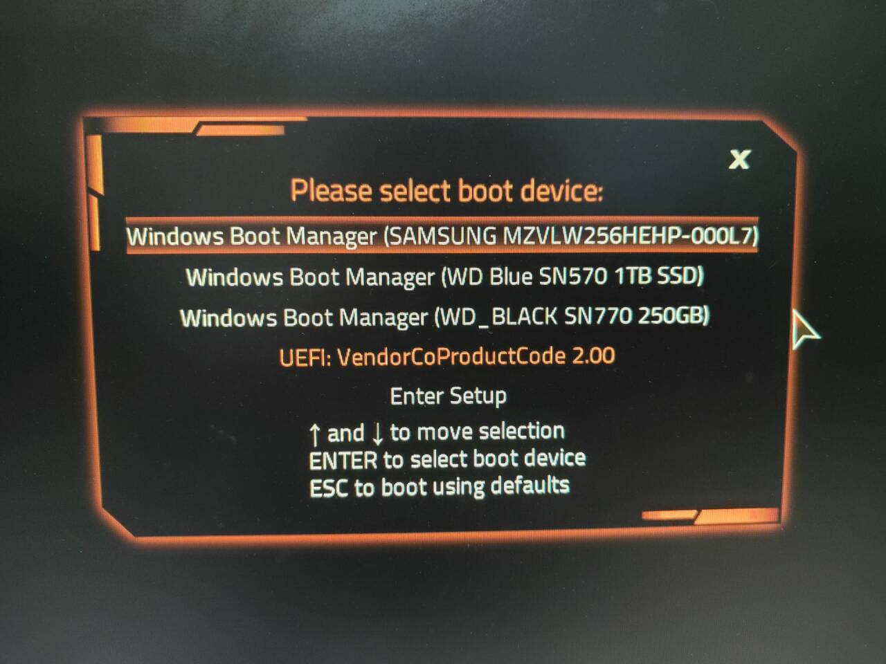
- 回车启动后会来到以下界面 显示如下信息拔掉盘 按下任意按键 启动系统
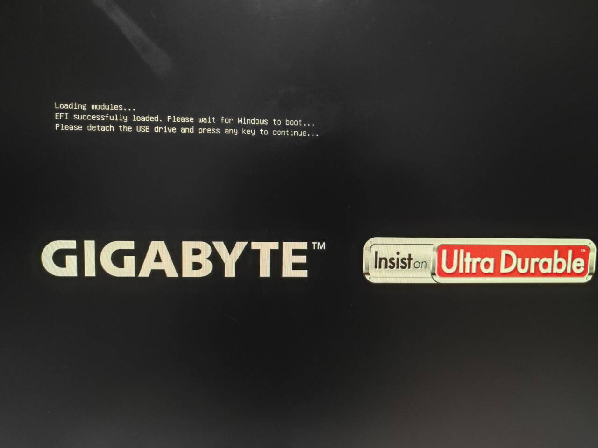
- 开机进入到系统之后打开登录器注入 （此时不要打勾注入）登录器消失上游戏即可
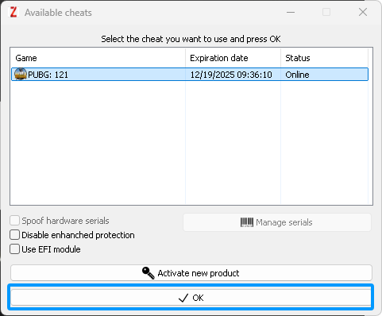 -->